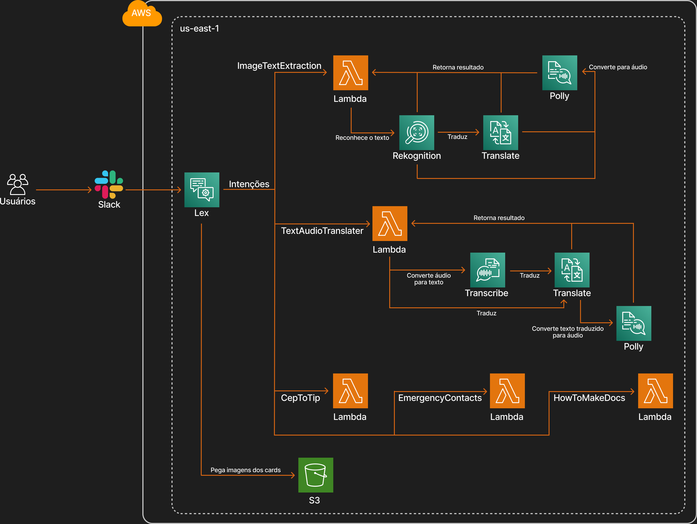

  <h1>ImigraLingo Assist</h1>

  <h2>ImigraLingo Assist - O desenvolvimento do chatbot destinado a servir como um Guia Multifuncional para Imigrantes Francófonos no Brasil</h2>

  
Conheça a incrível equipe por trás deste projeto

  <table>
    <tr>
      <td align="center">
        <a href="https://github.com/angemydelson">
           
          <b>Angemydelson Saint Bert</b>
        </a>
      </td>
      <td align="center">
        <a href="https://github.com/Sais01">
           
          <b>Cristofer Gaier Sais</b>
        </a>
      </td>
      <td align="center">
        <a href="https://github.com/NicolauNobre">
           
          <b>Nicolas Nobre Brasil</b>
        </a>
      </td>
      <td align="center">
        <a href="https://www.linkedin.com/in/felipemarzani/">
           
          <b>Felipe Marzani da Silva</b>
        </a>
      </td>
      <td align="center">
        <a href="https://www.linkedin.com/in/matheusspintom/">
           
          <b>Matheus Siqueira Pinto</b>
        </a>
      </td>
    </tr>
  </table>

---
---
## 📖 Sumário
- [1 - Objetivo](#ancora1)
  - [1.1 - Tecnologias Utilizadas](#ancora1-1)
- [2 - Funcionalidades](#ancora2)
- [3 - Desenvolvimento do Projeto](#ancora3)
- [4 - Estrutura de Pastas do Projeto](#ancora4)
- [5 - Arquitetura AWS](#ancora5)
- [6 - Dificuldades conhecidas](#ancora6)
- [7 - Licença](#ancora7)

---

## 1. Objetivo

  O ImigraLingo Assist tem como objetivo principal simplificar a vida dos imigrantes de língua francesa no Brasil, oferecendo assistência eficaz na superação de barreiras linguísticas, na integração na sociedade brasileira e na obtenção de informações vitais, desde traduções e localização de serviços até informações confiáveis sobre o processo de imigração. Nosso propósito é tornar a jornada de imigração mais suave e acessível, proporcionando as ferramentas necessárias para uma adaptação bem-sucedida e segura no Brasil.

### 1.1 Ferramentas Utilizadas

  
  
  
  
  
  
  
  
  
  
  
  
  
  
  

---

## 2. Funcionalidades
  
  **1. Extração de Textos em Imagens 📸🔍**

  Você encontrou um texto em português que não entende? Não se preocupe! Envie uma imagem com texto em português para o chatbot e receba a tradução em texto ou áudio, em português ou na sua língua nativa.

  **2. Tradução de Áudios e Textos 🗣️📜**

  Comunique-se sem barreiras. Envie textos ou áudios em português ou francês, e deixe o chatbot traduzir para você. Receba as traduções em formato de áudio ou texto.

  **3. Locais de Interesse Conforme Região 🌆📻**

  Informe ao chatbot o CEP da sua região e escolha um local de interesse (posto policial, hospital, shopping, restaurante, etc.). O chatbot fornecerá informações sobre os locais mais próximos, ajudando você a se orientar em sua nova cidade.

  **4. Contatos de Emergência 🚨🏥**

  Tenha acesso rápido aos números de emergência do Brasil, incluindo Bombeiro, Polícia e Ambulância, para sua segurança e tranquilidade.

  **5. Documentos de Imigração 📄🌐**

  Receba informações detalhadas sobre como realizar o processo de imigração no Brasil, com base em documentos oficiais do governo. Esteja preparado e informado durante sua jornada de imigração.

## 3 - Desenvolvimento do Projeto
  
O desenvolvimento do ImigraLingo Assist envolveu a criação e configuração de funções na plataforma AWS Lambda. Essas funções desempenham um papel crucial no processamento de imagens e áudios enviados pelo usuário, atendendo às intenções definidas no Amazon Lex. Para facilitar o gerenciamento e escalabilidade das funções Lambda, optamos por implementar o framework Serverless.
 
Para extrair texto de imagens, integramos o AWS Rekognition, capacitando nosso chatbot a identificar texto em português a ser traduzido. Além disso, utilizamos o serviço Translate da AWS para traduzir tanto texto quanto áudio, oferecendo traduções de alta qualidade em formato de áudio natural. A inclusão do AWS Transcribe nos permitiu receber áudios dos usuários e fornecer traduções com eficiência.
 
Para complementar a funcionalidade do chatbot, integramos a API do OpenCage com o OpenStreetMaps, permitindo aos usuários acessar informações sobre locais de interesse próximos com facilidade.

## 4 - Estrutura de Pastas do Projeto
- **src**
  - **lex**
    - **controllers**
      - **intents**
        - `cep_to_places_controller`
        - `emergency_contacts_controller`
        - `how_to_make_docs_controller`
        - `image_text_extraction_controller`
        - `introduction_controller`
        - `text_audio_translater_controller`
      - `router_controller`
    - **core**
      - `config`
    - **services**
      - `geo_service`
      - `polly_service`
      - `rekognition_service`
      - `transcribe_service`
      - `translate_service`
    - **utils**
  - **orchestrator**
    - **controllers**
      - `orchestrator`
    - **core**
      - `config`
    - **services**
      - `lex`
      - `s3`
      - `twilio`
    - **utils**
- **terraform**

## 5. Arquitetura AWS

  
  
 Arquitetura AWS

## 6. Dificuldades conhecidas

  **1.** Tempo de processamento do AWS Transcribe, levando em consideração o intervalo de timeout das funções Lambdas. 

---

# 7 - Licença

Este projeto está licenciado sob a Licença MIT - consulte o [Link](https://mit-license.org/) para obter mais detalhes.
