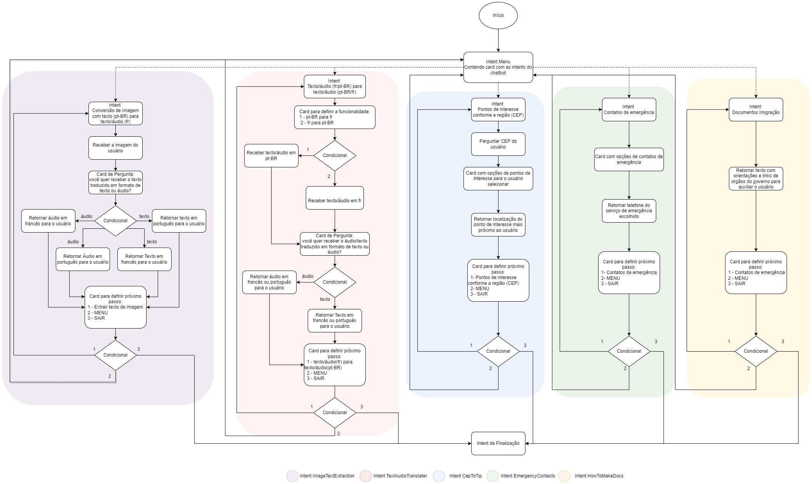

  

  <h1>UOL ImigraLingo Assist</h1>

  <h2>UOL ImigraLingo Assist - O desenvolvimento do chatbot destinado a servir como um Guia Multifuncional para Imigrantes Francófonos no Brasil</h2>

  
Conheça a incrível equipe por trás deste projeto

  <table>
    <tr>
      <td align="center">
        <a href="https://github.com/angemydelson">
           
          <b>Angemydelson Saint Bert</b>
        </a>
      </td>
      <td align="center">
        <a href="https://github.com/Sais01">
           
          <b>Cristofer Gaier Sais</b>
        </a>
      </td>
      <td align="center">
        <a href="https://github.com/NicolauNobre">
           
          <b>Nicolas Nobre Brasil</b>
        </a>
      </td>
      <td align="center">
        <a href="https://www.linkedin.com/in/felipemarzani/">
           
          <b>Felipe Marzani da Silva</b>
        </a>
      </td>
      <td align="center">
        <a href="https://www.linkedin.com/in/matheusspintom/">
           
          <b>Matheus Siqueira Pinto</b>
        </a>
      </td>
    </tr>
  </table>

---

---

  <h2>📑 Sumário</h2>

---

### 1. [Propósito](#ancora1)
   - 1.1 [Ferramentas Utilizadas](#ancora1-1)
   
### 2. [Evolução do Projeto](#ancora2)
   - 2.1 
   - 2.2 

### 3. [Estrutura de Diretórios](#ancora3)

### 4. [Infraestrutura na AWS](#ancora4)

### 5. [Desafios Enfrentados](#ancora5)

---

## 1. Propósito
-

  
-
---

### 1.1 Ferramentas Utilizadas

  
    <!--  -->
    
    
    <!--  -->
    
    
    <!--  -->
    
    
   

    

---

## 2. Evolução do Projeto

#### 2.1 

<!-- Detalhes sobre a contrução de v1/vision e resultados aqui -->
  - 

#### 2.2 

<!-- Detalhes sobre a contrução de v2/vision e resultados aqui -->
  - 

## 3. Estrutura de Diretórios

***

---

## Arquitetura do Bot

O bot terá como foco ajudar imigrantes da lingua francesa a se comunicar com a lingua portuguesa. 

  
  
 Arquitetura AWS
   
   
   
  
  
 Fluxograma das intents

## 5. Desafios Enfrentados

<!-- Desafios enfrentados durante o desenvolvimento -->

---
